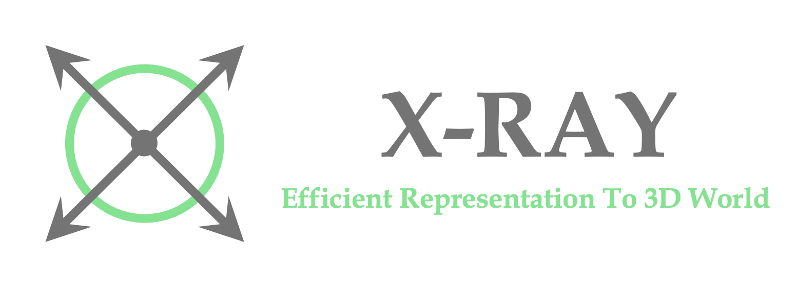

<p align="center">
    
</p>

# X-Ray: A Sequential 3D Representation for Generation.

<a href="https://tau-yihouxiang.github.io/projects/X-Ray/X-Ray.html"></a> 
<a href="https://huggingface.co"></a> 
<a href="https://huggingface.co/spaces"></a> 
<a href="https://huggingface.co/datasets/yihouxiang/X-Ray"></a> 
<a href="https://arxiv.org/abs/2404.14329"></a>


## Introduction
This repository contains the official implementation of the paper "X-Ray: A Sequential 3D Representation for Generation". We propose a novel 3D representation, X-Ray, that encodes the 3D structure of an object in a sequential manner. The X-Ray representation is a sequence of 2D images, each of which represents a cross-section of the object along a specific direction. We demonstrate that the X-Ray representation can be used to generate high-quality 3D shapes and poses. We show that our method can be used to generate 3D objects with both inside and outside shape and appearance.

<p align="center">
    
    <br>
    The example of X-Ray.
</p>

<p align="center">
    
    <br>
    The overview of 3D synthesis via X-Ray.
</p>


## Getting Started
### Installation
```bash
$ conda create -n xray python=3.10
$ pip install torch==2.1.2 torchvision==0.16.2 torchaudio==2.1.2 --index-url https://download.pytorch.org/whl/cu118
$ pip install -U xformers==v0.0.23.post1 --index-url https://download.pytorch.org/whl/cu118
$ pip install -r requirements.txt
```

### Download Dataset from [Huggingface](https://huggingface.co/datasets/yihouxiang/X-Ray).
```bash
$ cat 0*.zip > Objaverse_XRay.zip
$ unzip Objaverse_XRay.zip
$ ln -s /path/to/Objaverse_XRay Data/Objaverse_XRay
```
* A minimal dataset is located in ./example/dataset

## Training
### Train Diffusion Model
```bash
$ bash scripts/train_diffusion.sh
```

### Train Upsampler
```bash
$ bash scripts/train_upsampler.sh
```

## Evaluation
```bash
$ python evaluate_diffusion.py --exp_diffusion Objaverse_XRay --date_root Data/Objaverse_XRay
$ python evaluate_upsampler.py --exp_diffusion Objaverse_XRay --exp_upsampler Objaverse_XRay_upsampler
```

## TODO list 
- [x] Release Paper Details.
- [x] Release the training and testing source code.
- [ ] Release the pre-trained model. 
- [ ] Release the gradio demo. 

Checkpoints and Online Demo are comming soon!

## Authors
[Tao Hu](https://tau-yihouxiang.github.io) et al.


## Citation
If you find this work useful for your research, please cite our paper:
```
@misc{hu2024xray,
    title={X-Ray: A Sequential 3D Representation for Generation},
    author={Tao Hu and Wenhang Ge and Yuyang Zhao and Gim Hee Lee},
    year={2024},
    eprint={2404.14329},
    archivePrefix={arXiv},
    primaryClass={cs.CV}
}
```